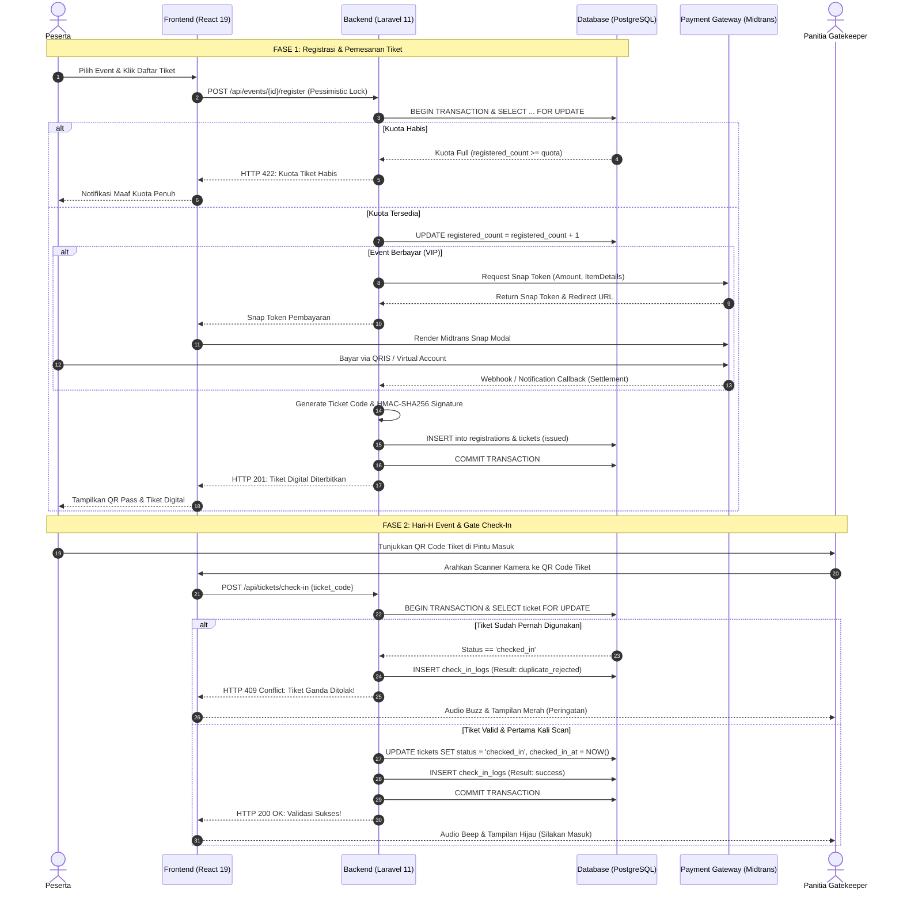
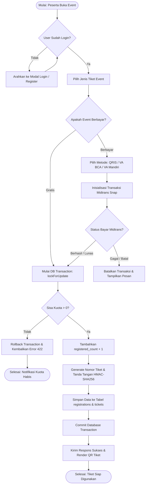
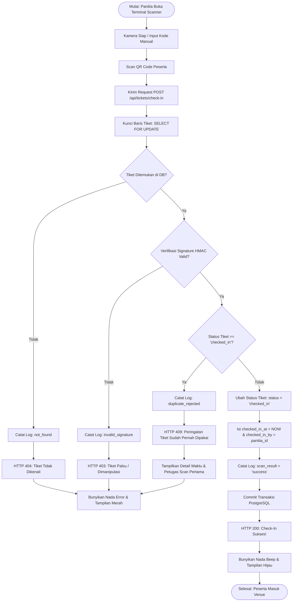
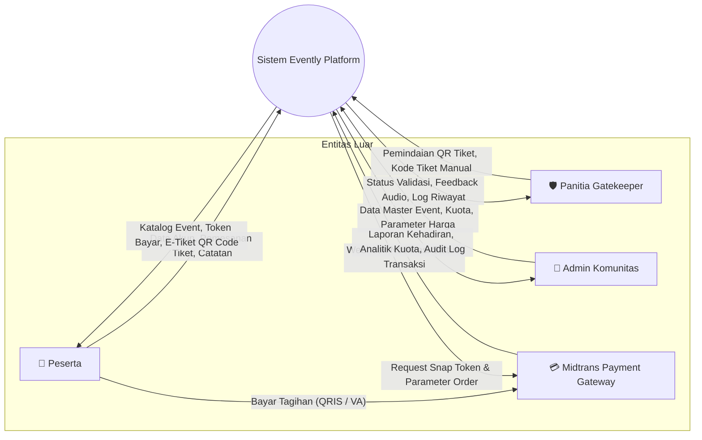
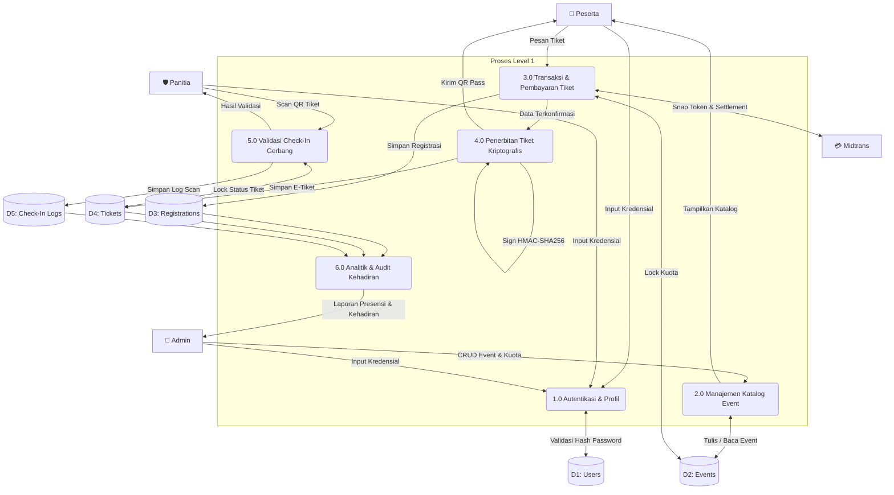
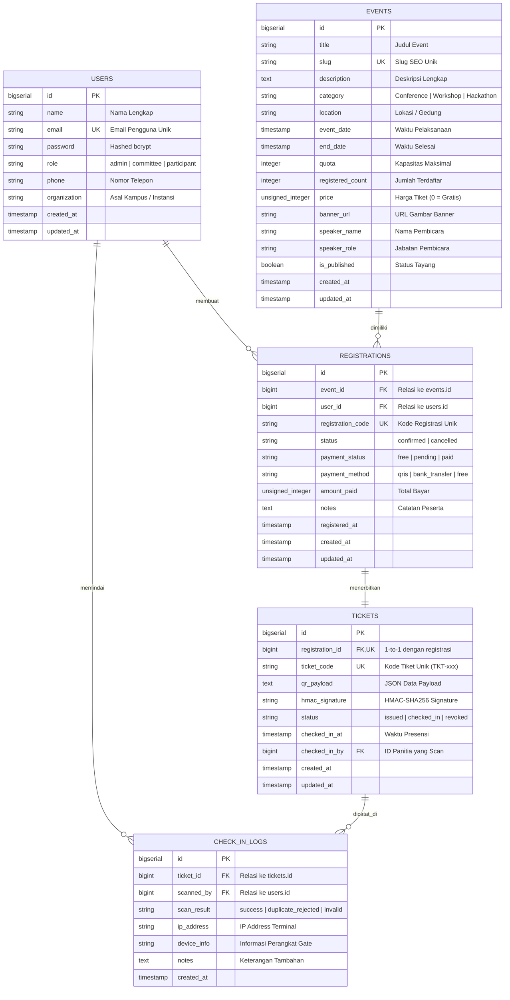

# Evently — SurabayaDev Event & Digital Ticketing Platform

> **SurabayaDev Volunteer Developer Team Technical Assessment**  
> Stack Arsitektur: **React 19 + TypeScript + Vite + Tailwind CSS + Laravel 11 (PHP 8.4) + PostgreSQL 16 + Midtrans Payment Gateway + Docker Compose**.

[](LICENSE)
[](docker-compose.yml)
[](https://laravel.com)
[](https://react.dev)
[](https://www.postgresql.org)

---

## 📌 Daftar Isi
1. [Ringkasan Proyek & Fitur Utama](#-ringkasan-proyek--fitur-utama)
2. [Kredensial Akun Demo (Role-Based Access)](#-kredensial-akun-demo-role-based-access)
3. [Panduan Instalasi & Cara Penggunaan](#-panduan-instalasi--cara-penggunaan)
4. [Desain Proses Bisnis (Business Process)](#-desain-proses-bisnis-business-process)
5. [Flowchart Struktur Alur Sistem](#-flowchart-struktur-alur-sistem)
6. [Data Flow Diagram (DFD)](#-data-flow-diagram-dfd)
7. [Entity Relationship Diagram (ERD)](#-entity-relationship-diagram-erd)
8. [Keunggulan Rekayasa Sistem (Engineering Highlights)](#-keunggulan-rekayasa-sistem-engineering-highlights)
9. [Daftar Endpoint REST API](#-daftar-endpoint-rest-api)

---

## 📖 Ringkasan Proyek & Fitur Utama

**Evently** adalah platform manajemen event dan penerbitan tiket digital modern yang dirancang khusus untuk menangani skenario beban tinggi (*high-concurrency*) pada perhelatan komunitas teknologi (seperti SurabayaDev 12th Anniversary). Sistem ini menjamin integritas data tanpa risiko *overselling* kuota (bebas *race condition*) serta pencegahan *duplicate check-in* atomik di gerbang masuk acara.

### 🌟 Fitur-Fitur Utama:
* **Katalog Event Dinamis**: Menampilkan event gratis dan VIP berbayar, lengkap dengan kategori, filter pencarian teks instan (*debounced*), kuota dinamis, dan detail narasumber.
* **Integrasi Pembayaran Midtrans Snap**: Mendukung transaksi pembayaran tiket VIP melalui QRIS (GoPay, OVO, ShopeePay) dan Virtual Account (BCA, Mandiri, BNI, BRI) Sandbox.
* **Pessimistic Concurrency Locking**: Melindungi transaksi pemesanan tiket dengan `SELECT ... FOR UPDATE` pada PostgreSQL untuk menjamin tidak ada kuota yang terjual melebihi kapasitas (*zero overselling*).
* **Tiket Digital Ber-QR Code Kriptografis**: Setiap tiket dilengkapi payload JSON yang ditandatangani dengan algoritma **HMAC-SHA256** berbasis *Secret Server Key* untuk mencegah pemalsuan tiket.
* **Terminal Gatekeeper Scanner**: Pemindai kamera interaktif untuk panitia gerbang masuk dengan audio-visual feedback (suara *beep* sukses, *warning buzz* tiket ganda/palsu) serta pencatatan audit log perangkat dan waktu presisi.
* **Quick Role Switcher**: Tombol cepat di navbar untuk reviewer/penguji agar dapat berganti peran secara instan antara **Peserta**, **Panitia**, dan **Admin** tanpa perlu mengetik ulang email dan password.

---

## 👥 Kredensial Akun Demo (Role-Based Access)

Aplikasi memiliki 3 hak akses peran (*Role-Based Access Control / RBAC*):

| Role | Email | Password | Hak Akses & Fitur |
| :--- | :--- | :--- | :--- |
| 🎓 **Peserta** (*Participant*) | `peserta@surabayadev.org` | `password` | Menjelajahi katalog event, pendaftaran event gratis & VIP berbayar (Midtrans), akses dompet tiket digital (*QR Pass*), unduh invoice. |
| 🛡️ **Panitia** (*Committee / Gatekeeper*) | `panitia@surabayadev.org` | `password` | Akses Terminal Pemindai Gerbang Masuk, scan QR Code via kamera/input kode manual, validasi instan, deteksi tiket duplikat, monitoring log presensi. |
| 👑 **Admin** (*Organizer Lead*) | `admin@surabayadev.org` | `password` | Manajemen Event (CRUD), pengaturan harga & kuota, analitik rasio kehadiran (*attendance rate*), ekspor rekap peserta, pemantauan transaksi. |

> 💡 **Tips Pengujian**: Anda juga dapat mengklik tombol **Role: Peserta / Panitia / Admin** di pojok kanan atas Navbar untuk login otomatis dalam 1 detik!

---

## 🚀 Panduan Instalasi & Cara Penggunaan

### 1. Menjalankan Menggunakan Docker Compose (Direkomendasikan)
Pastikan Docker dan Docker Compose telah terpasang di sistem Anda.

```bash
# 1. Clone repository
git clone https://github.com/ArfianPutraPratama/Evently.git
cd Evently

# 2. Jalankan seluruh container (PostgreSQL, Backend Laravel, Frontend React)
docker compose up -d

# 3. Cek status container
docker compose ps
```

Semua layanan akan aktif secara otomatis:
* **Frontend Web**: `http://localhost:5177`
* **Backend REST API**: `http://localhost:8080`
* **PostgreSQL Database**: `localhost:5433` (`evently_db`)

---

### 2. Cara Penggunaan Alur Aplikasi (Step-by-Step)

```
[1. Jelajahi Katalog] ➔ [2. Pilih Tiket] ➔ [3. Bayar via Midtrans] ➔ [4. Dapatkan E-Tiket] ➔ [5. Scan di Gerbang Masuk]
```

#### A. Alur Pemesanan Tiket (Sebagai Peserta)
1. Buka browser di **`http://localhost:5177`**.
2. Login sebagai **Peserta** (`peserta@surabayadev.org` / `password`).
3. Pilih salah satu event (misal: *Cybersecurity Hands-on* atau *Modern Full-Stack Mastery*).
4. Klik tombol **Daftar / Beli Tiket**.
5. Pilih metode pembayaran:
   * **QRIS Instan** (GoPay / OVO)
   * **Virtual Account BCA / Mandiri**
6. Klik **Bayar Sekarang**. Transaksi akan diproses melalui gateway Midtrans.
7. Setelah lunas, modal konfeti perayaan akan muncul dan **Tiket Digital QR Code** resmi diterbitkan ke tab **Tiket Saya**.

#### B. Alur Validasi Check-In (Sebagai Panitia / Gatekeeper)
1. Ganti role ke **Panitia** melalui tombol switcher di navbar.
2. Masuk ke halaman **Terminal Gatekeeper**.
3. Izinkan akses kamera atau ketikkan kode tiket manual (contoh tiket uji coba bawaan seeder: `TKT-12TH-CHECKED` atau tiket baru Anda).
4. **Hasil Verifikasi**:
   * 🟢 **BERHASIL (Status Hijau)**: Tiket asli, belum pernah dipakai, status berubah menjadi `checked_in`.
   * 🔴 **TIKET GANDA (Status Merah)**: Tiket sudah pernah dipakai sebelumnya, sistem menampilkan waktu dan petugas pertama yang melakukan scan (*anti-fraud*).
   * ⚠️ **TIDAK VALID**: Kode tiket palsu atau tanda tangan digital HMAC tidak cocok.

#### C. Alur Pengelolaan Event (Sebagai Admin)
1. Ganti role ke **Admin** di navbar.
2. Akses halaman **Admin Console / Dashboard**.
3. Kelola event (Tambah Event Baru, Edit Kuota, Ubah Status Publikasi).
4. Pantau metrik kehadiran secara *real-time* (Persentase kehadiran, jumlah tiket terbit vs kuota).

---

## 💼 Desain Proses Bisnis (Business Process)

Alur proses bisnis operasional tiket event SurabayaDev dari pendaftaran hingga kedatangan di venue digambarkan dalam diagram alir proses bisnis berikut:



---

## 🔀 Flowchart Struktur Alur Sistem

### 1. Flowchart Registrasi & Pembayaran Tiket



---

### 2. Flowchart Pemindaian Tiket di Gerbang Masuk (Anti-Duplicate Check-In)



---

## 📊 Data Flow Diagram (DFD)

### DFD Level 0 (Context Diagram)

Diagram Konteks mendefinisikan batas sistem Evently dengan 4 entitas eksternal:



---

### DFD Level 1 (Dekomposisi Proses)



---

## 🗄️ Entity Relationship Diagram (ERD)

Skema database relasional ternormalisasi (3NF) di atas PostgreSQL:



---

## 🛡️ Keunggulan Rekayasa Sistem (Engineering Highlights)

### 1. Zero Overselling via Pessimistic Row Locking
Pada saat flash sale pendaftaran tiket event populer, ribuan request masuk secara bersamaan. Pendekatan konvensional (`if ($event->registered_count < $event->quota)`) rentan mengalami **Race Condition** (*Phantom Read*), di mana kuota 100 bisa terjual menjadi 105 tiket.

Evently mengatasi hal ini dengan transaksi database terisolasi:
```php
DB::transaction(function () use ($eventId, $userId) {
    // Kunci baris event secara eksklusif di PostgreSQL hingga transaksi commit
    $event = Event::where('id', $eventId)->lockForUpdate()->firstOrFail();

    if ($event->registered_count >= $event->quota) {
        throw new \Exception('Maaf, kuota tiket untuk event ini telah habis.', 422);
    }

    $event->increment('registered_count');
    // Penerbitan registrasi & tiket secara atomik
});
```

### 2. Pencegahan Duplicate Check-In yang Aman
Di gerbang masuk dengan beberapa pintu scanner berbeda, dua peserta tidak dapat menggunakan tangkapan layar tiket yang sama:
```php
DB::transaction(function () use ($ticketCode, $committeeId) {
    $ticket = Ticket::where('ticket_code', $ticketCode)->lockForUpdate()->first();

    if ($ticket->status === 'checked_in') {
        CheckInLog::create([
            'ticket_id' => $ticket->id,
            'scanned_by' => $committeeId,
            'scan_result' => 'duplicate_rejected',
            'notes' => 'Peringatan: Tiket ganda terdeteksi!'
        ]);
        return response()->json(['message' => 'Tiket sudah pernah digunakan.'], 409);
    }

    $ticket->update([
        'status' => 'checked_in',
        'checked_in_at' => now(),
        'checked_in_by' => $committeeId
    ]);
});
```

### 3. Tanda Tangan Kriptografi HMAC-SHA256
Setiap tiket ditandatangani secara kriptografis menggunakan `hash_hmac('sha256', $payloadData, $appKey)`. Jika seseorang berusaha mengubah nama atau event ID di dalam QR Code secara ilegal, tanda tangan digital tidak akan cocok dan tiket otomatis ditolak oleh scanner terminal.

---

## 📡 Daftar Endpoint REST API

| Method | Endpoint | Hak Akses | Deskripsi |
| :--- | :--- | :--- | :--- |
| `POST` | `/api/auth/register` | Publik | Mendaftarkan akun peserta baru |
| `POST` | `/api/auth/login` | Publik | Otentikasi dan penerbitan Sanctum Token |
| `GET` | `/api/auth/me` | Logged In | Mengambil profil user & ringkasan pendaftaran |
| `POST` | `/api/auth/logout` | Logged In | Menghapus token otentikasi aktif |
| `GET` | `/api/events` | Publik | Mengambil katalog event (Filter search, category) |
| `GET` | `/api/events/{slug}` | Publik | Detail event lengkap beserta ketersediaan kuota |
| `POST` | `/api/events/{id}/register` | Peserta | Mendaftar tiket event (Free / Paid) |
| `POST` | `/api/payment/snap-token` | Peserta | Membuat token transaksi Midtrans Snap |
| `POST` | `/api/payment/finish` | Peserta | Konfirmasi dan penerbitan tiket pasca bayar |
| `GET` | `/api/tickets/my-tickets` | Peserta | Mengambil seluruh tiket digital milik user |
| `GET` | `/api/tickets/{code}` | Logged In | Mengambil payload QR Code & status tiket |
| `POST` | `/api/tickets/check-in` | Panitia/Admin | Validasi pemindaian tiket di pintu masuk |
| `GET` | `/api/admin/overview` | Admin | Statistik global pendaftar, hadir, dan rasio |
| `POST` | `/api/admin/events` | Admin | Membuat event baru |
| `PUT` | `/api/admin/events/{id}` | Admin | Memperbarui informasi & kuota event |
| `DELETE` | `/api/admin/events/{id}` | Admin | Menghapus data event |

---

## 👨‍💻 Pengembang & Kontributor

* **Nama Pengembang**: Arfian Putra Pratama
* **Email**: `arfian.23001@mhs.unesa.ac.id` / `pianprams3@gmail.com`
* **Proyek**: Technical Assessment Developer Team — Komunitas SurabayaDev
* **Lisensi**: MIT License
